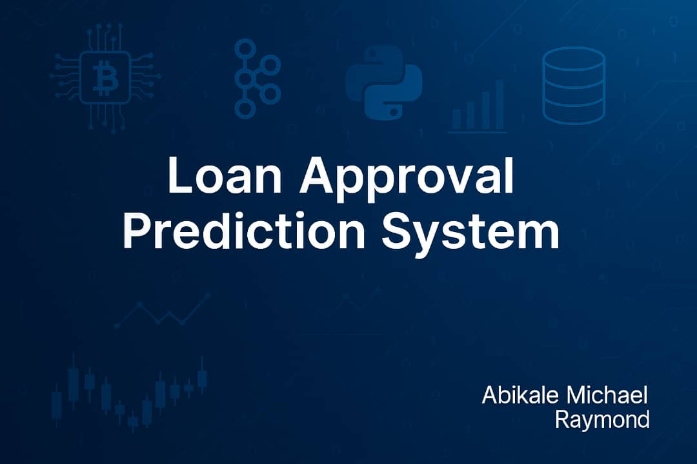

# Loan Approval Prediction System




## 🧠 Overview
This project is a machine learning-based system designed to predict whether a loan application will be **approved** or **rejected** based on a variety of applicant-related parameters. It simulates how a financial institution might use data to make faster and more accurate loan decisions.

---

## 📊 Business Relevance
Loan approval processes can be slow, biased, or inconsistent. This system provides a **data-driven approach** to improve decision-making by identifying key patterns in past approvals and rejections.

---

## 🏗️ Project Structure

loan-default-prediction/
│
├── 📁 data/
│   ├── raw/
│   │   └── train_data.csv
        └── test_data.csv
│   ├── processed/
│   │   └── cleaned_test_data.csv
│       └── cleaned_train_data.csv
│
├── 📁 notebooks/
│   └── loan_default_analysis.ipynb     # Main Jupyter Notebook
├── 📁 src/
│   ├── preprocessing.py                # Clean & transform data
│   ├── feature_engineering.py          # Create and select features
│   ├── model.py                        # Train, evaluate, and save models
│   ├── prediction.py                   # Make predictions using saved model
│   └── visualization.py                # Charts & plots (EDA, feature importance)
├── 📁 models/
│   └── best_loan_model.pkl                  # Saved model
│   └── label_encoders.pkl
│   └── onehot_encoder.pkl
│   └── X_processed.pkl
│   └── y_encoded.pkl
│   └── scaler/
│       └── scaler.pkl
│   └── pca/
│       └── pca.pkl
├── 📁 outputs/
│   └── df_test_predictions.csv
│   └── test_predictions_from_df_train.csv
│     
│
├── 📄 README.md                        # Project overview
├── 📄 requirements.txt                 # Python dependencies
├── 📄 .gitignore                       # Ignore data, models, .ipynb_checkpoints
└── 📄 run_pipeline.py                  # (Optional) Script to run everything end-to-end


---

## 🚀 Tech Stack

- Python (Pandas, NumPy, Scikit-learn)
- Jupyter Notebook
- Matplotlib / Seaborn
- Git & GitHub
- [Add more tools later like LightGBM, SHAP, or Streamlit]

---

## 🔍 Key Features

- Missing value handling
- Exploratory Data Analysis (EDA)
- Feature engineering
- Training classification models (e.g., Logistic Regression, Random Forest)
- Evaluation using accuracy, precision, recall, F1-score
- Future plan: Model explainability + Streamlit app deployment

---


## 🛠️ How to Run

1. Clone the repo:
   ```bash
   git clone https://github.com/techieemike/loan-approval-prediction-system.git
   cd loan-approval-prediction-system

2. Create and activate a virtual environment:
    # On Windows:
    venv\Scripts\activate
    # On macOS/Linux:
    source venv/bin/activate
4. Install dependencies:
    pip install -r requirements.txt
5. launch the streamlit app:
   streamlit run appy.py


📌 Roadmap
✅ Load and inspect dataset  
✅ Handle missing values  
✅ Perform feature engineering  
✅ Train multiple classifiers (Logistic Regression, Decision Tree, Random Forest, SVC, KNN, Naive Bayes)  
✅ Evaluate best-performing model  
✅ Compare model performance using AUC-ROC and Accuracy  
⭐ Best Model: Logistic Regression (Accuracy: 0.8618, AUC-ROC: 0.8498)  
✅ Deploy as a Streamlit dashboard or REST API  


## 📈 Model Results

| Model                  | Accuracy | AUC-ROC |
|------------------------|----------|---------|
| Logistic Regression    | 0.8618   | 0.8498  |
| Decision Tree          | 0.7317   | 0.7040  |
| Random Forest          | 0.8374   | 0.7814  |
| Support Vector Machine | 0.8455   | 0.7941  |
| K-Nearest Neighbors    | 0.7886   | 0.7471  |
| Naive Bayes            | 0.7724   | 0.7542
  |

✅ **Best Model:** Logistic Regression with **Accuracy: 0.8618** and **AUC-ROC: 0.8498**


---

### 3. 📊 Add a Feature Summary Table

## 🔍 Feature Summary

| Feature              | Description                                |
|----------------------|--------------------------------------------|
| Gender               | Male/Female                                |
| Married              | Yes/No                                     |
| Dependents           | Number of dependents                       |
| Education            | Graduate/Not Graduate                      |
| Self_Employed        | Self-employed status                       |
| ApplicantIncome      | Income of the applicant                    |
| CoapplicantIncome    | Income of co-applicant                     |
| LoanAmount           | Loan amount requested                      |
| Loan_Amount_Term     | Term of the loan                           |
| Credit_History       | Credit history (1: good, 0: bad)           |
| Property_Area        | Rural / Semiurban / Urban                  |


```

 🤝 Contributing
Have suggestions, issues, or improvements? Feel free to submit a pull request or open an issue.


Badges


📄 License
This project is licensed under the MIT License.


🙋‍♂️ Author
Abikale Michael Raymond
AI | Data Engineering | DevOps
LinkedIn: https://www.linkedin.com/in/michael-raymond-abikale-27363949/
GitHub: https://github.com/techieemike
Email: abikalemichaelraymond@gmail.com
